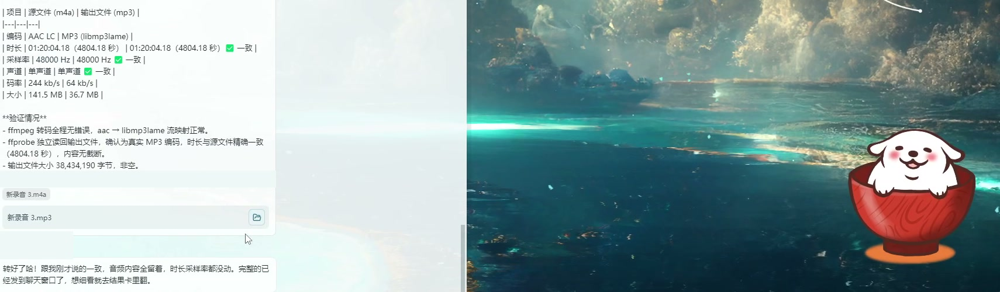
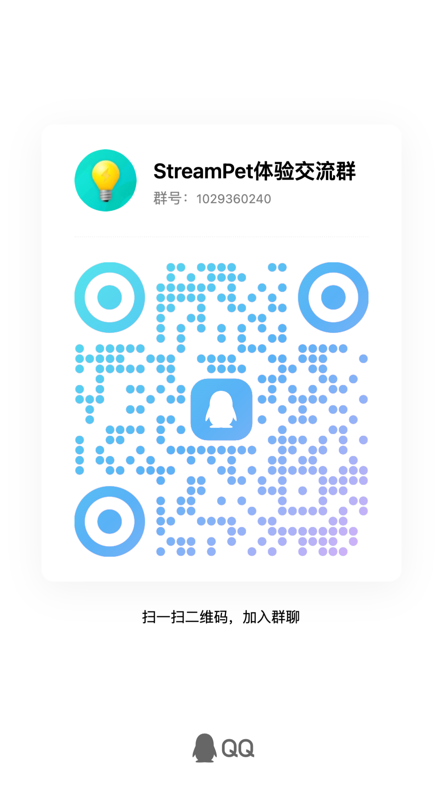

  
  <h1>NearMate</h1>
  
<strong>工作在手边，搭子在身边。</strong>

  
常驻 Windows 桌面的 AI 工作搭子，让你喜欢的角色陪你交流，也帮你推进手头的事。

  

    <a href="https://roverscode.github.io/NearMate/">官方网站</a> ·
    <a href="https://github.com/RoversCode/NearMate/releases/latest">下载 Windows 版</a> ·
    <a href="https://roverscode.github.io/NearMate/#community">加入体验交流</a> ·
    <a href="https://github.com/RoversCode/NearMate/issues">问题反馈</a>
  

  
Windows x64 · CUDA / Universal 双版本 · 应用内可申请 24 小时试用

## 让你的桌面，多一个帮手

- **聊你正在看的。** 当前屏幕、选中文字、截图和文件都能成为交流的上下文。问一句「这张图讲了什么」，或把材料交给搭子一起理思路。
- **以你喜欢的方式相处。** 用角色卡设置当前角色的身份和语气，搭配 Live2D 虚拟形象与语音；可以打字，也可以直接说话。
- **让事情继续往前走。** 配置后台工作后，当前角色可以调用工具整理材料、处理文件或完成多步骤操作。需要权限或补充信息时，会请你决定；进展和结果可以在界面查看。

NearMate 承载你选择的角色。上方人物是品牌形象，实际虚拟形象、声音与相处方式由你在应用内配置。

## 它在桌面上是什么样

  

实机演示：把音频转成 MP3，在聊天窗口查看结果卡与交付文件。右侧为用户配置的虚拟形象。点击图片可以查看大图。

**再花 60 秒，认识你的桌面搭子。** [在官网观看宣传片](https://roverscode.github.io/NearMate/#film) · [下载 1080p MP4](https://github.com/RoversCode/NearMate/releases/download/v0.1.0-rebuild.1/NearMate-Promo-60s-1080p.mp4)

## 下载与安装

前往 [官网下载页](https://roverscode.github.io/NearMate/#download) 或 [GitHub Releases](https://github.com/RoversCode/NearMate/releases/latest)，选择适合这台电脑的版本：

| 版本 | 适合的电脑 |
| --- | --- |
| **CUDA · NVIDIA 版** | 配备兼容 NVIDIA 显卡的 Windows x64 电脑 |
| **Universal · 通用版** | AMD / Intel 等设备；提供 DirectML、Vulkan 与 CPU 运行方式，通过首次向导确认支持情况 |

两种版本提供相同的产品功能，实际运行速度取决于硬件与所选模型。

1. 下载所选版本的安装程序 **`.exe` 和全部 `.bin` 分卷**。
2. 把所有文件放在同一文件夹，保留原文件名，再双击 `.exe` 安装。
3. 打开 NearMate，跟随首次向导完成配置。

**不要混用 CUDA / Universal，也不要混用不同发行的分卷。** Releases 附带 `SHA256SUMS.txt`，可用于核对下载文件是否完整。当前安装程序尚未使用 Windows 代码签名。

## 第一次见面

1. **取得产品授权。** 在应用内申请 24 小时试用，或填写已有的 NearMate Key。
2. **连接模型 API。** 准备支持的模型服务 API Key，并按向导配置。产品授权与模型 API 是两项独立配置。
3. **准备语音与角色。** 按向导检查设备、下载所需语音模型、完成试听，再选择角色卡与虚拟形象。
4. **开始一件小事。** 试着说「帮我解释一下这张图」，或提交一份材料，请搭子整理思路。

需要后台工作时，在控制台的「后台工作」设置中另行配置相应服务、模型与凭据，再选择合适的权限。

### 试用与费用

**24 小时试用无需先填写 NearMate Key。** 领取成功后连续计时 24 小时，领取结果受服务开放时间、每日名额与设备资格限制，以应用内显示为准。首次准备和试用的每次新启动会话都需要联网。

试用提供 NearMate 的产品使用资格，**不包含模型 API 额度**。模型 API 需要自行准备，费用由对应厂商单独收取；后台工作所接入的服务也可能产生费用。正式授权信息可在体验交流群了解。

### 数据与记忆

桌面界面和部分语音能力在本机运行；模型推理、授权和后台工作可能访问外部服务。对话及选用的屏幕、材料内容会按功能需要发送给已配置的服务，请结合厂商的数据政策选择使用内容。

近期对话和任务上下文在后台进程运行期间保留，退出后台进程后不继续保留。角色卡与设置单独保存。

## 一起体验 NearMate

分享角色搭配、交流使用方法，或反馈遇到的问题。

**QQ 体验交流群：1029360240**。用手机 QQ 扫描下方二维码，也可以搜索群号加入。

  

二维码与群内名称仍显示历史名称「StreamPet 体验交流群」，即本产品的体验群。

## 反馈问题

请通过 [GitHub Issues](https://github.com/RoversCode/NearMate/issues) 提交问题，说明 NearMate 版本、CUDA / Universal、Windows 版本、硬件概况、复现步骤和错误提示；也欢迎在体验群里交流。

公开提交截图或日志前，请移除 API Key、NearMate Key、个人文件路径及私密聊天内容。
